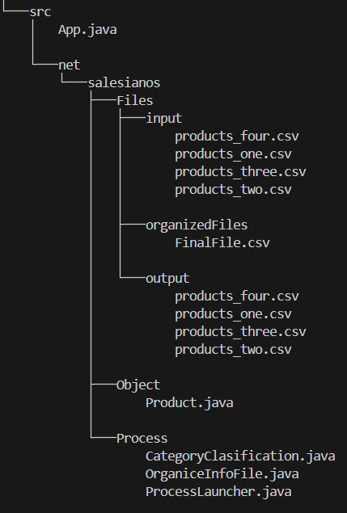
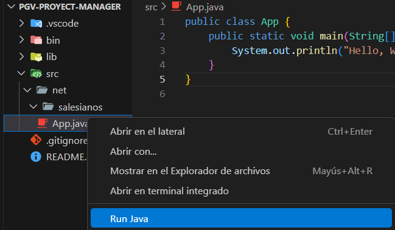

# Administrador De Productos:

## UD1 – Práctica – Programación multiproceso

## Problema a resolver:

Una empresa tiene en diferentes archivos, en los cuales hay almacenados distintos productos desorganizadamente, hay productos de tecnologia, higiene, alimentos, etc.

Devido a la desorganizacion, se solicita que un programa revise todos estos archivos, los organice, los almacene en otro archivo, y los muestre por consola para que el personal pueda clasificarlos de manera adecuada.

## Descripcion de la solucion

Programa en Java que lee varios ficheros de productos en paralelo (cada fichero puede procesarse en un subproceso), fusiona y organiza los registros en un único fichero de salida y, finalmente, muestra ese fichero por consola.

## Estructura del proyecto

- src/App.java - Programa principal
- src/net/salesianos/... — código fuente
- src/net/salesianos/files/input/ — ficheros de entrada (varios)
- src/net/salesianos/files/output/ — fichero de salida generado
- src/net/salesianos/Object/Product.java — Clase producto
- src/net/salesianos/files/organizedFiles/ — fichero de que contiene todos los datos
- README.md



## Formato de los ficheros de entrada

Se recomienda un formato CSV simple por línea, por ejemplo:
`id,nombre,categoria,cantidad,precio`

Ejemplo:

```
1,Televisor,tecnologia,8,499.99
2,Shampoo,higiene,25,4.50
```

## Comportamiento del programa

- Escanea un directorio de entrada para localizar ficheros de productos con terminacion .csv.
- Crea un subproceso por cada fichero .csv que encuentra (se ejecuta de forma concurrente).
- Cada subProceso:
- Crea un fichero de salida con los datos organizados de manera alfabetica por cada fichero de entrada.
- En el programa principal:
- Se crea un proceso que lee los ficheros de salida organizados de manera alfabetica.
- Fusiona todos los registros en un único fichero de salida (data/output/FileResult.csv).
- Se crea un metodo que lee el fichero final con todos los datos insertados de todos los ficheros (FinalResult.csv).
- Al finalizar, se lee el fichero de salida y lo muestra por consola de manera ordenada, organizados por el campo categoria.

## Uso (ejemplos)

### Guía de inicio

1. Clona el repositorio:

```cmd
git clone https://github.com/HortuaDev/PGV-PROYECT-MANAGER.git
```

2. Abre el proyecto en VSCode:

```cmd
cd PGV-PROYECT-MANAGER
code .
```

3. Crea la carpeta `/bin`, `output/` y `organizedFiles`

```

mkdir bin
mkdir src/net/salesianos/output
mkdir src/net/salesianos/organizedFiles
```

```

4. Compila las clases .java para crear las .class (requerido)

```

javac -d bin src/net/salesianos/Process/_.java src/net/salesianos/Object/_.java src/App.java

```

5. Asegúrate de tener instalado:

- Java JDK 11 o superior
- Extension Pack for Java en VSCode

6. Ejecuta el programa:
   presiona clik derecho sobre el archivo `App.java` y seleciona la opcion `Run Java`



## Ejemplo de salida por consola

Al terminar, el programa imprimirá algo tipo:
Organizando todos los productos por categoria

```

Contenido del fichero final: FinalFile.csv

## CATEGORiA: alimentos

## ID NOMBRE CANTIDAD PRECIO

1 arepa 40,00 2,25
4 empanada 60,00 1,70
7 malta 35,00 4,10

```

```
